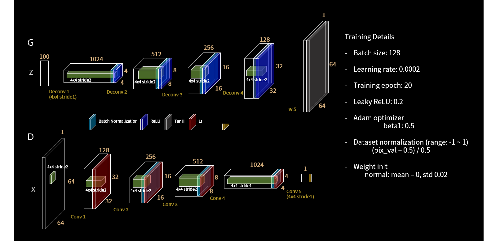

# CapsGAN 
Unsupervised representation learning with CapsNet based Generative Adversarial Networks


## Description

Coalesces Wassertein Distance algorithm based generative adversarial networks with deep convolutinal network based discriminator replaced by CapsNet architecture.

## Prerequisits and Requirements

* Python > 3.6
* PyTorch
* TorchVision
* TorchNet
* TQDM
* Visdom [_optional_]

** For training, an NVIDIA TITAN XP GPU was used. __Using CUDA with GPU is strongly recommended__. CPU is supported but speed of training will be very slow.

## Datasets

* MNIST
* CIFAR-10

__Running MNIST__

Pass in the gpu device number for e.g. `0`
```
$ python --dataset mnist --nc 1 --imageSize 32 --dataroot ./data --cuda {GPU_DEVICE_NUMBER}  --workers 4
```
__Running CIFAR10__

Pass in the gpu device number for e.g. `0`
```bash
$ python3 main.py --nc 3 --dataset cifar10 --dataroot ./data --cuda {GPU_DEVICE_NUMBER} --workers 4 --niter [NUM_EPOCHS] 
```

## Usage

Utilizes FAIR's visdom as visulization tool. If you'd like to visualize the test and train results, run with `visualize` args. 

```bash
$ sudo python3 -m visdom.server &
$ python3 main.py --visualize --cuda
```


To run with MLP as G or D, run:
```bash
$ python3 main.py --dataset cifar10 --dataroot ./data --cuda {device_num} --experiment {Name} --mlp_G --ngf 512
```

__Using CUDA__

Pass in the gpu device number for e.g. `0`
```
$ python main.py --cuda {GPU_DEVICE_NUMBER}
```

__Enable Visualization__

Start the server (probably in a screen or tmux):
```bash
python -m visdom.server -port 8097
```

Run with `--visualize` parameter
```
$ python main.py --cude {GPU_DEVICE_NUMBER} --visualize
```

## Architecture

Using DCGAN (and variants - BN, no-BN) as baseline against the CapsNet architecture. 



## Contact
Please send an email to raeidsaqur[at]cs[dot]toronto[dot]edu for questions, PRs etc.

*** Note: __Improved ReadMe is in the works!__ 


